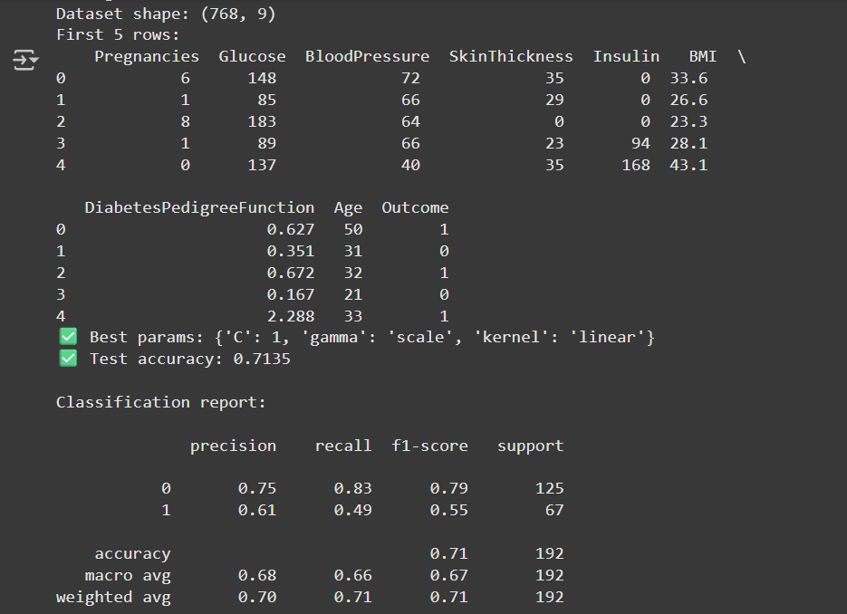
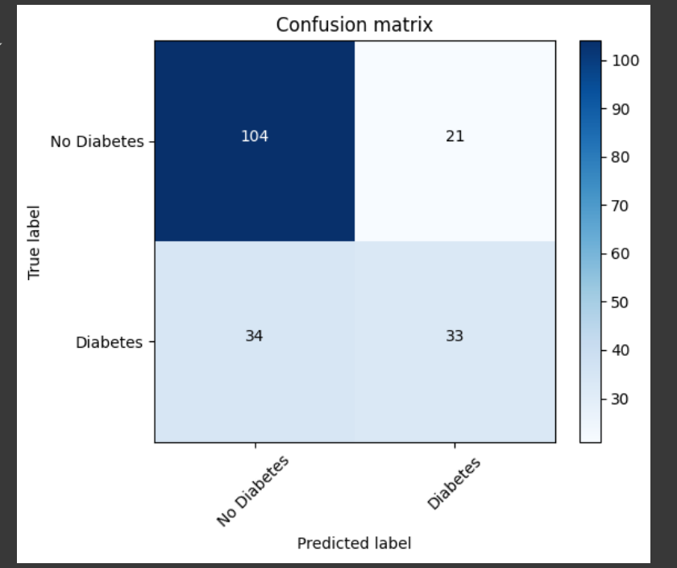

# Assignment-1-SVM
# Diabetes Prediction using SVM

## 📌 Project Overview
This project uses the **Pima Indians Diabetes Dataset** from Kaggle to build a machine learning model that predicts whether a patient is diabetic or not based on medical parameters.  
We implemented a **Support Vector Machine (SVM)** classifier with hyperparameter tuning using GridSearchCV.

---

## 📊 Dataset
- Source: [Kaggle - Pima Indians Diabetes Database](https://www.kaggle.com/datasets/gargmanas/pima-indians-diabetes)  
- Number of rows: **768**  
- Number of columns: **9**  

### Features:
- `Pregnancies`: Number of times pregnant  
- `Glucose`: Plasma glucose concentration  
- `BloodPressure`: Diastolic blood pressure (mm Hg)  
- `SkinThickness`: Triceps skinfold thickness (mm)  
- `Insulin`: 2-Hour serum insulin (mu U/ml)  
- `BMI`: Body mass index (weight in kg/(height in m)^2)  
- `DiabetesPedigreeFunction`: Diabetes pedigree function  
- `Age`: Age of the person  
- `Outcome`: (1 = Diabetic, 0 = Not Diabetic)  

---
## Outputs
### Model Training Output


### Confusion Matrix
  

## ⚙️ Installation
Clone the repository and install dependencies:
```bash
git clone https://github.com/your-username/diabetes-prediction.git
cd diabetes-prediction
pip install -r requirements.txt


